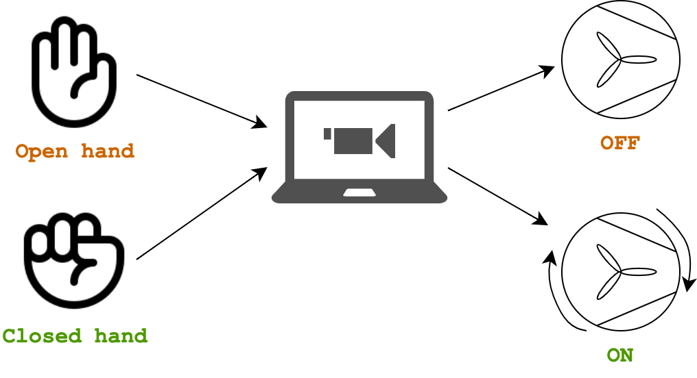

# Plant ML
Plant ML is an experiment exploring how machine learning and computer vision can be used to interact with natural elements. This project was developed within a two-day hackathon for the **bio techno art exhibition**. Raed more about the project [here](https://adeolao.carrd.co/#project-plantml-biotechno). 

|   | |  |
| :---: | --------- | :---: |
| The final project | | The bio techno art exhibition poster |

This project uses Python to call a tensorflow model to recoginse hand gestures (trained through Google's Teachable Machine) and send those outputs to Arduino to control a motor. 

## Setup 

**What you need**:
- Python 3.8
- [Arduino IDE](https://www.arduino.cc/en/software) 
- Arduino board (UNO R3 is used in this project)
- Trained tensorflow image recignition model ([Google's Teachable Machine](https://teachablemachine.withgoogle.com/) is used to train)
- A 3V-6V DC motor
- A dual 16-pin motor driver IC (The L293D is used in this project)
- Power supply (set at 5V)

### Code installation

**Install the requirements**: 

`pip install tensorflow tensorflowjs numpy opencv-python pyserial`

### Arduino setup

To set up the Arduino UNO, please follow the following diagram to correctly set up the motor: 

Upload the `plant_ml.ino` code to the Arduino board.

## Run the code

To run the project, run the following:

`python plant_ml.py`

Enjoy! 